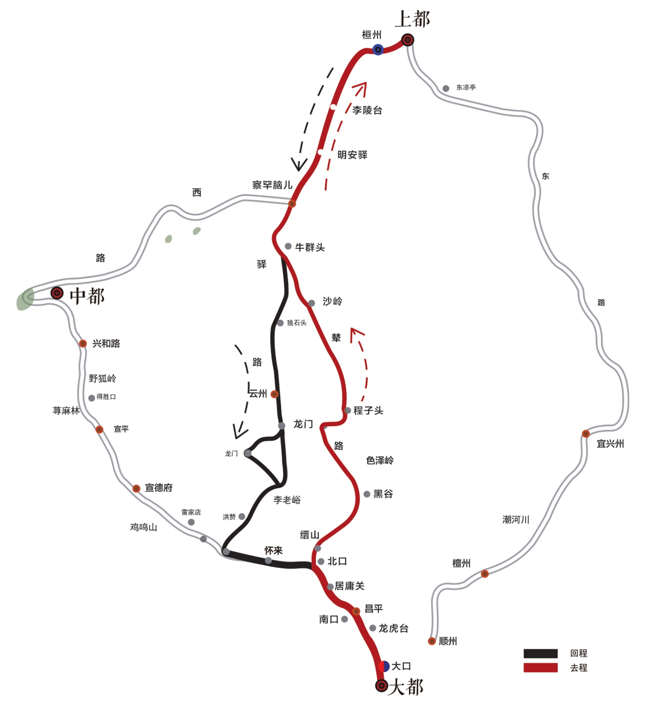
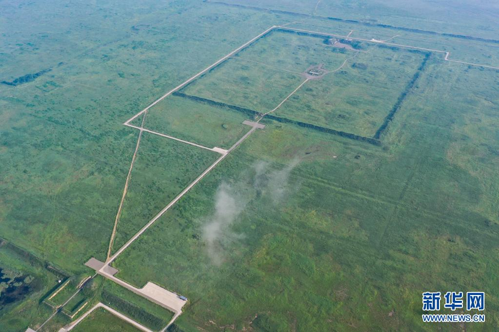

# 从秦始皇到忽必烈汗

- [从秦始皇到忽必烈汗](#从秦始皇到忽必烈汗)
  - [楔子](#楔子)
  - [从大都到上都](#从大都到上都)
  - [Xanadu](#xanadu)

## 楔子

> 應該是*上都*。有時又稱為……**仙納度**，被忽必烈封為御用長樂穹宮。 —— _Netflix 《三体》_

2024 年 3 月，流媒体大厂 Netflix 版的《三体》终于上映了，一时国内外观众褒贬不一。有说是一部政治正确的牺牲品；也有说为了符合欧美观众的口味，需要做适当的改编。

Netflix 版开头便是一场文革批斗大会，这在国内也引起了一阵讨论。其实电视剧反而在这一点上参照了《三体》连载时的顺序，将这一幕放在了整个故事的开头。

大刘的科幻作品中杂糅了未来、科技、人文、历史等等。《三体》中的人列计算机一幕，便是其中的代表。但这一幕在 Netflix 版中经过了改写，原著中，这一人列计算机军队来自秦始皇，而 Netflix 版变成了忽必烈，更重要的是他们所处之地名为“上都”。这一切由何而来？

## 从大都到上都
2019 年 5 月 25 日下午，第十七届华语文学传媒盛典在北京举行。北大教授罗新徒步追随蒙元帝王的辇路而写下的《从大都到上都：在古道上重新发现中国》，为他赢得第“年度散文家”的殊荣。[^luoxin]

成吉思汗之孙忽必烈称汗后建立两都制，以燕京（今北京）为大都，以开平为上都。上都位于今内蒙古自治区锡林郭勒盟正蓝旗上都镇。

_▲从大都到上都线路图[^map]_

1358 年，红巾军攻陷上都城，宫阙城池毁于兵火。2012 年，联合国教科文组织将元上都遗址列入世界遗产名录。

<!-- <figure> -->
  <!--  -->
  <!-- <figcaption>元上都遗址</figcaption> -->
<!-- </figure> -->

_▲元上都遗址[^shangdu]_

“去上都”这一信念，西方更盛。

> ……比如，著名旅行作家威廉·达尔瑞坡(William Dalrymple)出版于 1989 年的《在上都——一次追寻》(In Xanadu：A Quest)[^in]，记录二十二岁的他从地中海东岸出发重走马可·波罗之路，直至中国内蒙古的上都，在虚实两个层面借用了 Xanadu 的意象，可说是此书大获成功的因素之一。

## Xanadu

西方世界对“上都”的执着，源自于 19 世纪英国浪漫诗人柯尔律治的《忽必烈汗》它的开头是这样的：

> **Kubla Khan**
> 
> In Xanadu did Kubla Khan
> A stately pleasure-dome decree:
> Where Alph, the sacred river, ran
> Through caverns measureless to man
>   Down to a sunless sea.
> ......

> **忽必烈汗**
>
> 忽必烈汗把谕旨颁布：
>   在上都兴建宫苑楼台；
> 圣河阿尔弗流经此处，
> 穿越幽深莫测的洞窟，
>   注入阴沉的大海。
> …… [^kubla]

这首诗的灵感来自于柯尔律治服用鸦片后的幻觉，他在梦中看到了忽必烈汗的上都。这首诗被认为是英国浪漫主义诗歌的代表作之一。其中的 Xanadu 一词，译指“上都”，但随着时间的推移，其意象不断扩展，我们将一步一步探讨。

回到本源，这一切源自那位意大利旅行家马可波罗……

[^luoxin]: [第十七届华语文学传媒盛典揭晓，罗新获“年度散文家”](https://culture.ifeng.com/c/7n4iCJc9LCC)。 另按[豆瓣](https://book.douban.com/subject/35869077/)词条，该书还获得春风悦读盛典年度非虚构奖、单向街书店文学奖年度作品、《东方历史评论》年度历史图书，但笔者在查询单向街奖项时仅找到提名无法确认。

[^map]: 图源罗新《从大都到上都：在古道上重新发现中国》

[^shangdu]: 2021.7.21 元上都遗址（无人机照片），图源新华网[《夏日里的元上都遗址》](http://www.xinhuanet.com/photo/2021-07/22/c_1127683755.htm)

[^in]: 该书 2021 年已出中文版，《仙那度：追寻马可·波罗的脚步（英）威廉·达尔林普尔，社会科学文献出版社

[^kubla]: 中译来自《神秘诗！怪诞诗！柯尔律治的三篇代表作》（英）柯尔律治著；杨德豫译，人民文学出版社，1992
