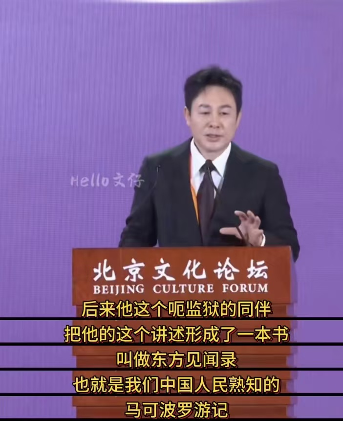
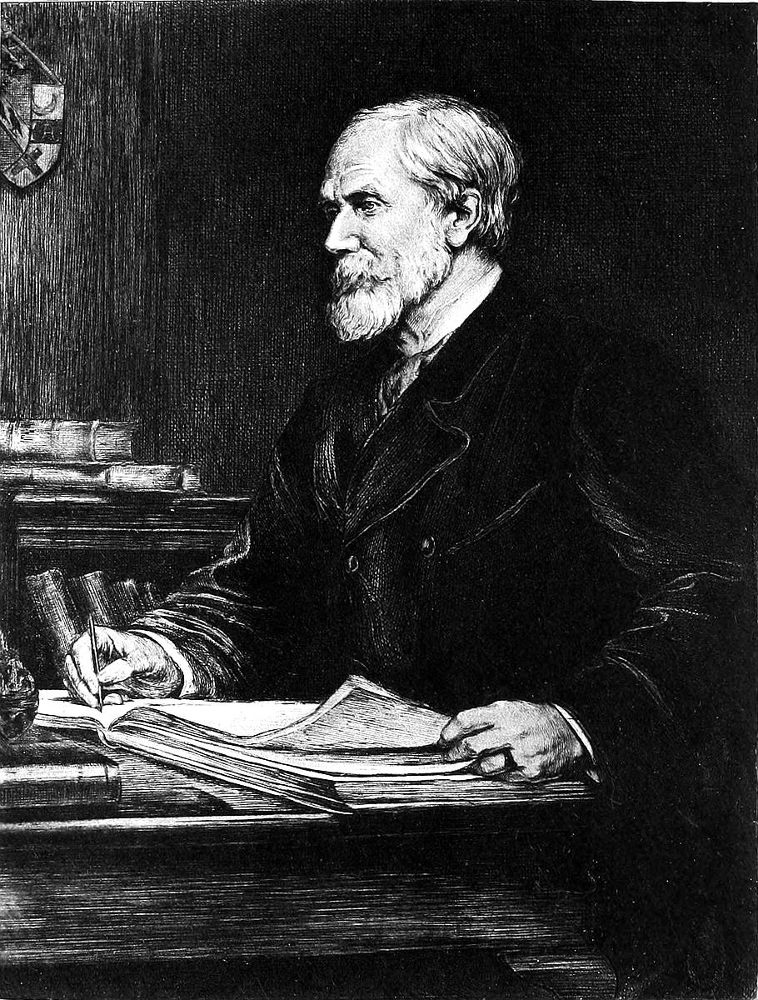
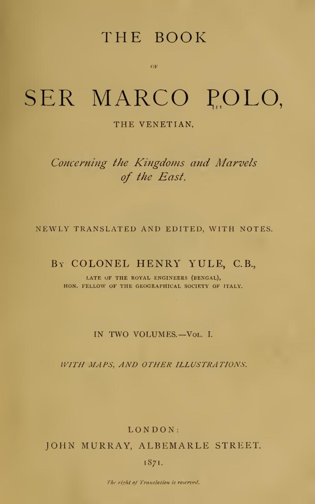

# 马可波罗游记的研究

<!--  -->

2024年9月20日，北京文化论坛，高启强老师全程脱稿演讲[^zhang]，讲述了中意文化交流，文化开放的重要性，获得盛赞。高老师提及了马可波罗在中意文化交流中起到的重要作用，以及《三体》在意大利受到的欢迎。寻着高老师的演讲，一起来探索马可波罗游记的变迁。

<figure><figcaption><p>张颂文 2024 北京文化论坛演讲：中国影视全球化传播中的演员责任</p></figcaption></figure>

## 游记的诞生

在[序章](../00_pre/pre.md)中提到，Netflix 版《三体》中的人列计算机场景由秦始皇变为忽必烈，大军在上都集结。这上都在西方具有神圣的象征，而这一地位的确立，首先便是来自马可波罗的叙述。

在马可波罗从中国回到威尼斯几个月后，威尼斯派出了一支远征队去攻击热那亚舰队，据说马可·波罗指挥了一艘战舰。1298 年 9 月发生了一场战斗，威尼斯舰队被击败，马可·波罗在试图挽救局势时表现出极大的勇气，但被击伤并被俘。他被送到热那亚。

在热那亚的监狱中，马可·波罗遇到了一位职业浪漫小说作家，来自比萨同为囚犯的鲁斯蒂切洛（Rustichello）；它并不是马可·波罗旅行的故事，而是“被称为世界描述和奇异事物的书”，是科学地理学的先驱。它是对中世纪亚洲大部分地区的严肃而宝贵的描述，逐国逐城，夹杂着一些讲得很好的故事 —— 但这些故事并不是马可·波罗旅行的故事。

“几个月内整个意大利都充满了它”，但这种流行并没有让原始文本被保存下来。

从 13 世纪开始，各种语言各种版本的马可波罗游记不断出现，有法语、法意混合语、威尼斯语、托斯卡纳语、英语、德语、拉丁语等，数不胜数。哪种版本更可靠，更接近原始文本，他们之间各是什么关系，“剪不断理还乱”。直到 500 多年后， 1871 年，英国人汉学家亨利·尤尔（Henry Yule）出版了他的英译本《马可·波罗游记》，开启了对众多版本的系统研究。


## 亨利·尤尔（Henry Yule）

<figure><figcaption><p>Henry Yule from <cite>THE TRAVELS OF MARCO POLO</cite> on gutenberg.org</p></figcaption></figure>


### 早年
亨利·尤尔 (Henry Yule)[^memoir_of_henry]是威廉·尤尔少校 (Major William Yule) 与第一任妻子伊丽莎白·帕特森 (Elizabeth Paterson) 所生的最小儿子，于 1820 年 5 月 1 日出生于苏格兰的中洛锡安郡 (Midlothian)。 

他的父亲曾是一名驻扎孟加拉军队的军官（生于 1764 年，卒于 1839 年），教养好、思想开明，也是优秀的波斯和阿拉伯学者，了解东方。后来在印度，他先后担任拉克纳乌和德里宫廷的助理驻扎官（Assistant Resident），于 1806 年回国。

亨利·尤尔（Henry Yule）的童年主要是在东洛锡安郡的小村庄因弗雷斯克（Inveresk）度过的。他常说，他最早的记忆是和他的小表妹一起坐在她父亲位于爱丁堡乔治街（George Street）的房子门口，听着一位路过的风笛手演奏。很久以后，他称呼小表妹为妻子。

他还回忆起另一件事，带着幽默的满足感。受到父亲关于丛林故事的启发，尤尔（当时大约六岁）在后花园里挖了一个大象陷阱，大获成功。因为他很快就看到他的约翰叔叔（John）头朝下掉进了陷阱，心中既恐惧又欣喜。他在八岁之前失去了母亲，几乎唯一记得的关于她的事情是她给了他一个小灯笼，让他在冬夜照亮放学回家的路。

妻子去世两三年后，尤尔少校搬到爱丁堡，正对着卡尔顿山（Calton Hill），直到去世，就在亨利·尤尔前往印度之前。

亨利·尤尔高中毕业后，原本计划去剑桥大学（他的名字确实已经被录取），并在获得学位后成为一名律师。1833年，刚开始尤尔与导师汉密尔顿（Rev. H. P. Hamilton）和他善良的妻子相处得很愉快。但在导师搬到剑桥后，1835年，他被转到由牧师詹姆斯·查利斯（Rev. James Challis）照顾。1836年春天，查利斯先生被任命为剑桥大学的普卢默教授，由于天文台没有空间，尤尔不得不离开他，并在一段时间内成为伦敦大学学院的学生，那是一个非常沉闷的时期。

### 从军

到这时，尤尔已经决定不去伦敦学习法律，而是选择去印度加入军队。因此，1837年2月，他加入了东印度公司的军事学院阿迪斯科姆（Addiscombe）。1838年12月，他以他那一届学员的第一名毕业（获得赠剑，退役后只要再穿上制服他就必定配带此剑），并被正式任命为孟加拉工程师，1839年初前往皇家工程师总部英国肯特郡（Kent）的查塔姆（Chatham）。

他的朋友科林森（Collinson）说，“……他拥有比我们大多数人更好的古典知识；……尤尔不是一个科学工程师，尽管他对职业的不同分支有很好的一般知识；他的天赋更多地在于多样的知识，结合了强大的理解力和出色的记忆力，以及一种特殊的绘图能力，这在后来的生活中被证明是非常有价值的……”

在查塔姆完成一年的学习后，尤尔准备启程前往印度，但首先去向他的亲戚怀特将军告别。在他离开之前，他向他的表妹安妮求婚并被拒绝。这件事，他的第一次挫折，似乎给他的印度之行蒙上了一层阴影。

他通过当时新开通的陆路前往印度，访问了葡萄牙，在直布罗陀停留，拜访了他的表兄帕特里克·尤尔少校（后来成为将军）。他奉命在也门的亚丁（当时刚刚被占领）停留，报告水源供应情况，并交付一套气象和磁性仪器，以便在那里开设一个天文台。当时的陆路旅行是这样的：骑着骆驼和阿拉伯人一起穿越沙漠到苏伊士。但这种行程不利于保护精密仪器。到达亚丁后，他发现预定的观察员已经去世，天文台尚未开始建设，所有仪器都已损坏。因此，他别无选择，只能立即继续前往印度的加尔各答，他在1840年底到达那里。那一年尤尔 20 岁。

亨利的两个哥哥也在印度工作。老大乔治·乌德尼·尤尔（George Udny Yule，1813-1886 年）在孟加拉公务员部门工作。另一个哥哥罗伯特（1817-1857 年）后来在印度叛乱期间在德里附近去世。

尤尔的第一项任务是在当时荒凉的卡西亚山区（Khasia Hills），他被派往那里以设计方法将当地的煤炭运输到平原。尽管气候令人沮丧（切拉普杰是世界上降雨量最高的地方），尤尔却非常享受这段时光，并且总是怀着特别的愉快回忆起在这里度过的时间。他未能成功完成任务，因为茂密的森林和巨大的悬崖构成了无法克服的障碍，但他收集了大量关于这个国家和人民的有趣观察，这些人是一个非常原始的蒙古种族。他后来将这些观察写成了两篇非常出色且非常有趣的文章（这是他发表的第一批文章）。

在印度服役期间，尤尔通过信件重新向怀特(Annie White)小姐求爱，并最终成功。他于1843年5月从孟买启航，同年9月在巴斯与那位才华横溢、心胸宽广的女士结婚，她直到最后都是他生活中最强大和最幸福的影响力。

尤尔和他的妻子于1843年11月启航前往印度。接下来的两年主要从事灌溉工作，没有特别值得一提的事情。这些年是非常幸福的，除了一个情况，那就是气候严重影响了他妻子的健康，她因疾病和当时的猛烈医疗治疗而几乎命悬一线，医生严令她返回英国，并禁止她再回印度。

送她上船后，尤尔返回运河的工作岗位。1845年12月，工作有了一些变化，因为第一次锡克战争[^sikh1]的爆发，几乎所有的运河官员都被调到前线。尤尔在这次战役中的任务是为英国军队的前进在萨特莱杰河上架设桥梁，这已经是一项足够艰巨的任务。

他的哥哥罗伯特·尤尔当时在第16骑兵团服役，参加了1846年1月28日阿利瓦尔战役中该团的壮丽冲锋。从他哥哥和其他参战人员那里得到的细节，亨利·尤尔准备了一幅生动的战斗场景素描，后来由麦克林（Haymarket）以彩色石印的形式出版。


第二次锡克战争中[^sikh2]，尤尔率领军队投入战场。1849 年 1 月 13 日，他出席了奇利安瓦拉 (Chillianwallah) 惨淡的“胜利”，其中他最生动的记忆似乎是被称为“阿拉伯的劳伦斯”的亨利·劳伦斯 (Henry Lawrence) 的突然出现，让人记忆犹新。他来自伦敦，但仍然穿着传奇的阿富汗斗篷。


在印度期间，尤尔仍断断续续的往来与英国和印度之间。1850 年，尤尔开始了他对马可波罗的第一次认真研究。然而，他小时候就已经被这个奇妙的故事迷住了，在他父亲的图书室里——可能是马斯登（William Marsden）[^marsden]的版本。

1852 年秋天，威灵顿公爵[^willington]去世，尤尔在英国见证了他的葬礼。12月初，他的休假即将到期，再次启程前往印度，留下妻子和唯一的孩子。当他回到印度，“副官蒙罗上尉简直不敢相信我出席了威灵顿公爵的葬礼，几天前他在报纸上读到了葬礼”。报纸？！而我，一名见证者，一名客人，来到这片山间荒野——这时距离我离开英国已有 2 个半月了。”

尤尔是色盲，年轻时固执地坚持自己对颜色的看法，他选择了一些布料做裤子，尽管他的裁缝胆怯地抗议说：“这不太符合您平时的品味，先生。”结果是，作为政府副秘书长（Under-Secretary to Government）的尤尔穿着鲜艳的酒红色裤子，震惊了加尔各答的官方人士。好友贝克也对尤尔提出异议。“酒红色！胡说，我的裤子是银灰色的，”尤尔强力反驳道。“我想我最终说服了他，”贝克在很久之后向尤尔的女儿讲述这个故事时自豪地说。“那他放弃了吗？”“哦，没有，”


### 退役

尤尔在加尔各答与他的上司坎宁勋爵（Lord Canning）建立了深厚的友谊，以致于当坎宁退休时，他邀请尤尔陪他回到家乡，他的影响力将为尤尔找到合适的工作。尤尔对印度的厌倦在这个时候达到了极点。此外，在为坎宁勋爵以及再前任的达尔豪西勋爵（Lord Dalhousie）这样的领导人服务，并赢得他们的全部信任和友谊之后，重新开始与新人合作，对他来说几乎是不可忍受的。

坎宁勋爵和尤尔于1862年3月底离开加尔各答；尤尔时年 42 岁；在马耳他，他们分别。坎宁勋爵前往英国，尤尔在罗马与妻子和孩子团聚。几周后，在佛罗伦萨，传来了坎宁勋爵在伦敦意外去世的消息，时间是1862年6月17日。那天传来的致命消息，以及尤尔的深切悲痛，不是因为失去了他的前途，而是因为失去了一位最高尚和宽宏大量的朋友。不久之后，尤尔去了英国，在那里他受到了坎宁勋爵代表的热情接待，他们给了他一份感人的纪念品，坎宁勋爵写字台上习惯放置的银质旅行烛台。但他撰写坎宁勋爵传记的提议没有结果，因为亲属们，拒绝出版任何回忆录。

在1864年春天，尤尔租下了一座宽敞且迷人的老别墅，位于意大利托斯卡纳的卢卡温泉（Bagni di Lucca）的最高处。这座别墅俯瞰着周围的栗树覆盖的山丘和蜿蜒的河流，景色非常美丽。

在这里，他写了很多最终形成《契丹与通往契丹的道路》（Cathay and the Way Thither）的内容。这个夏天，尤尔还开始在威尼斯档案馆进行调查，并访问了弗留利省，寻找他的老旅行家之一，贝阿托·奥多里科（Beato Odorico）的历史材料。1866年春天，《契丹与通往契丹的道路》出版了，并立即获得了好评。

在1867年，尤尔开始系统地工作，准备出版他长期计划的马可·波罗游记的新版本。显然，这个计划在这一年首次成形，但它已经在他的脑海中酝酿了很久。他习惯于早起；夏天，他有时会去海里游泳，或者在早餐前散步；更常见的是，他会一直写作到早餐时间，他喜欢独自用餐。早餐后，他会翻阅他的笔记本，通常在十点钟之前快速步行到图书馆，那里是他工作的地方。他会在那里工作到下午两三点钟，然后回家，阅读《泰晤士报》，回复信件，接待或拜访朋友，然后继续他的书的工作，通常在家里其他人都睡着后很久才结束。在这种情况下，他的家人很少见到他，但当他完成了《马可·波罗》的一章，或者发现了一些有趣的新发现时，他会拿给他的妻子阅读。她对他的工作一直非常感兴趣，他也非常信任她的文学直觉，认为她是一个既有见地又有同情心的批评家。

尤尔在马可·波罗研究方面的第一个成果是对颇节（Pauthier）版本的马可·波罗的评论，发表在1868年的《季刊评论》(Quarterly Review)上。1870年，他的伟大作品《马可·波罗》完成了，1871年出版，并迅速获得了意大利地理学会颁发的非常美丽的金质奖章的认可，随后在1872年获得了皇家地理学会的创始人奖章。同时，巴黎的地理学会和亚洲学会、意大利和柏林的地理学会、博洛尼亚学院以及其他学术机构都授予他荣誉会员的称号。

尤尔是出于对工作的纯粹热爱和没有期望公众认可而完成的，因此当他发现对他的《马可·波罗》的需求如此之大，以至于几年后就出版了第二版，这对他来说是一个巨大的惊喜和满足。准备这个扩大版本，以及其他各种杂项工作，使他在接下来的三年里忙得不可开交。

在1875年春天，就在《马可·波罗》第二版出版后不久，尤尔不得不哀悼妻子的去世。他当时不在西西里，在她去世几小时后回到病榻前。她多年来患有严重的心脏病，但她的临走时是完全的平静。她被安葬在西西里岛蒙特佩莱格里诺（Monte Pellegrino）的美丽公墓中。只有尤尔最亲近的朋友才能真正理解她的去世对他的意义。

在这场灾难之后不久，尤尔搬到了伦敦。当年秋天，他的老朋友威廉·贝克爵士（Sir William Baker）从印度委员会退休后，索尔兹伯里勋爵（Lord Salisbury）立即选择他接替空缺的席位。正是因这一席位，在 1978 年，尤尔在参见索尔兹伯里勋爵组织的茶会上，见到了晚清著名外交官郭嵩焘。[^guo]郭在日记中介绍了尤尔注释马可波罗游记一事。

《倫敦與巴黎日記》 / 卷十八 / 光緒四年三月：

> 晚赴沙乃斯茶會，所見類比爾、倭爾色裏（並新派充統領）、勞色爾（愛爾蘭部尚書）、非爾拉（印度總理醫務）、優諾（著有注釋馬爾克波羅書。馬耳克波羅隨元世祖入中國，為西洋人入中國之始。所記風土人情，西洋多不之信，優諾為加注釋云），其餘熟人及相見寒暄而不知名姓者甚多。

在1877年，尤尔娶了他的第二任妻子，她是他的一位老朋友的女儿，比他小二十岁，是一个非常和蔼可亲的女人，直到她在1881年的不幸去世，她一直让他非常幸福。从他加入印度委员会开始，他在印度事务部的职责自然占据了他大部分的时间，但他也继续进行大量的文学工作。这一年，尤尔开始担任哈克卢特学会（Hakluyt Society）[^hakluyt]的主席，并在1885年当选为皇家亚洲学会（Royal Asiatic Society）的主席。

在尤尔成为陆军卫生委员会成员后，与弗洛伦斯·南丁格尔（Florence Nightingale）[^nightingale]建立了联系，这是他非常珍视和享受的特权，尽管他常说：“她比皇家委员会更难应付，并且以最优雅和迷人的方式，立即发现我所不知道的一切！”


### 尾声
1889年，尤尔的生命已经接近尾声。春天，他觉得有必要辞去印度委员会的职务，尽管他被任命为终身成员。在这个场合，时任印度事务大臣的克罗斯勋爵（Lord Cross）成功地劝说他接受K.C.S.I.（印度星章骑士），这是他几年前拒绝的荣誉。这一年，哈克卢特学会出版了尤尔最后一部重要作品《威廉·海奇爵士的日记》(Diary of Sir William Hedges) 的最后一卷。

12月27日，星期五，尤尔收到了一封来自巴黎的电报，宣布他当天被提名为法兰西学院（Académie des Inscriptions）的通讯会员。

12月30日，星期一，天气晴朗，亨利·尤尔醒来时感觉非常清爽，心情特别愉快，甚至欢快。他说他感觉很舒适。他提到他计划写的书，并让他的女儿给他的出版商写信，告知不可避免的延误：“去给约翰·默里(John Murray)写信”，这是他对她说的最后一句话。上午，他见了一些朋友和亲戚，中午临近，他的体力逐渐衰退，昏迷了一阵，他在女儿和一位从爱丁堡赶来看他的老朋友的陪伴下平静地离世。尤尔去世后大约两个小时，纳皮尔勋爵(F.-M. Lord Napier of Magdala)前来拜访，出于友谊，他被允许见到他早年的朋友最后一面。当纳皮尔勋爵出来时，他对尤尔的女儿说：“他看起来像是刚刚开始一项伟大的工作。”


## 手稿的研究

<figure><figcaption><p>THE BOOK OF SER MARCO POLO</p></figcaption></figure>

Yule 将马可波罗的文本分为四种主要类型：

* (1) 地理文本或最古老的法语文本。
  * 巴黎国家图书馆的珍贵手稿 fr. 1116（原名7367）。它于1824年由法国地理学会出版，自那时起被称为《地理文本》。地理文本中拥有的是旅行者原始记录的几乎完全准确的抄本，这些记录是在热那亚的监狱中记录下来的。
* (2) 重新编辑的法语文本；颇节（Pauthier）采用此文本。
  * 一个经过修剪和精炼的版本，可能是根据马可·波罗的指示，但准确性存疑。法国汉学家颇节曾对这类手稿进行研究整理，并出版了他编辑的法语版本。
* (3) 皮皮诺（Pipino）的拉丁文本。
  * 这个粗糙的拉丁文版本是从一个意大利副本翻译过来的。皮皮诺的版本似乎是在波罗生命的晚年完成的。
* (4) 拉穆西奥（Ramusio）的意大利文本。
  * 在拉穆西奥版本中嵌入了旅行者在其生命晚期记录下来的补充回忆，但这些回忆被多次翻译、编纂和编辑处理。拉穆西奥还从用了那些仅在他的版本中找到的段落。

```nomnoml
[F  | 法意混合语]
[FG | 宫廷法语]
[P | 拉丁语 by Pipno]
[R | 意大利语 by Ramusio]
```

Yule 在 1871 年出版的《马可·波罗游记》中，是对法语版本的英文翻译，但是他未使用 fr. 1116，而是使用了颇节（Pauthier）的所整理过的宫廷法语版本。尽管 Yule 承认 fr. 1116 是最好的文本，但他认为其语言的笨拙和冗长使其无法使用。


[^zhang]: [张颂文北京文化论坛最新演讲，全程脱稿，声音好听：中国影视全球化传播中的演员责任](https://b23.tv/9zkFkz2)

[^memoir_of_henry]: 该节主要内容来自亨利女儿，在第三版马可波罗游记中的回忆文章， [MEMOIR OF SIR HENRY YULE from The Travels of Marco Polo — Volume 1 by Marco Polo and da Pisa Rusticiano](https://www.gutenberg.org/cache/epub/10636/pg10636-images.html#MEMOIR_OF_SIR_HENRY_YULE)

[^sikh1]: 1845年至1846年，英国东印度公司与锡克帝国之间的一场局部战争。以英国东印度公司的胜利而告终，也使得锡克帝国的部分领土被并入英印领地。

[^sikh2]: 1848年至1849年，东印度公司与锡克帝国之间又一次战争。东印度公司获胜，锡克帝国被征服，旁遮普地区最终成为东印度公司的西北边境省。


[^marsden]: 威廉·马斯登（William Marsden, 1754 - 1836）爱尔兰东方学家、钱币学家和语言学家。将意大利语版本的《马可波罗游记》翻译成英文，并在1818年出版。

[^willington]: 威灵顿公爵（Duke of Wellington, 1769－1852），英国军事家、政治家，在1815年的滑铁卢战役中与布吕歇尔带领英普联军击败拿破仑指挥的法军，奠定了拿破仑战争中反法同盟的最终胜利。

[^guo]: 至少有三位学者提到郭嵩焘获得了马可波罗游记，但笔者并未发现出处。 [《清末汉文文献中有关马可•波罗来华的最早记述》邹振环](http://iqh.ruc.edu.cn/zglsdlyj/lsdl_lzjj/qsdlyj/50b021da8c5f490ba2182fbf101daa1f.htm)，记述‘光绪四年三月初一（1878年4月3日），郭嵩焘出席英国新任外相的茶会上，结识了“马尔克波罗书”的注释者优诺，并在当天的日记中写道：“马尔克波罗随元世祖入中国，为西洋人入中国之始。所记风土人情，西洋多不之信，优诺（今译玉尔）为加注释云。”以后，这位被郭嵩焘誉为“考求东方学问者”，还把自己注释的《马克波罗游历中国记》，送给了郭嵩焘。’此文还提到，“1990年李长林在《世界史研究动态》第10期上发表了《国人研究与介绍〈马可·波罗游记〉始于何时？》一文……”，此处虽提及他事，或送书一事来源于此，但笔者未能找到该文。 [《马可波罗及《游记》在中国早期的传播》——邬国义在华东师范大学的讲演](https://www.whb.cn/zhuzhan/guandian/20140714/10273.html)，提到“中国人最早获得《游记》原著的是近代第一个驻欧使臣郭嵩焘。他出使欧洲所撰《伦敦巴黎日记》中就曾七次提到马可波罗及其《游记》，还记下了有关外国人的反映。但是受限于时代历史的因素，郭氏在《日记》中虽有关于马可波罗及《游记》的记录，实际上却没有产生任何影响，并未在社会上激起涟漪。”也并未提及获取原著的出处。音频节目 [《Ep.75 马可·波罗：妄人、商人还是官员？》](https://www.xiaoyuzhoufm.com/episode/6458c99005cc8f3e8b4fd215)中马晓林教授也提及此事，但笔者仍未获取到出处。

[^nightingale]: 弗洛伦斯·南丁格尔（Florence Nightingale，1820－1910），英国护士，近代护理学和护士教育创始人。在克里米亚战争期间（1853-1856年）因其在战地医院的工作而闻名，她改善了伤员的护理条件，显著降低了死亡率；南丁格尔经常在黑夜中提灯巡视病房，又被誉为“提灯女士”。

[^hakluyt]: 哈克卢特学会（Hakluyt Society）是一个专注于出版和研究早期探险和旅行文献的学术组织。学会成立于1846年，以纪念英国地理学家和历史学家理查德·哈克卢特（Richard Hakluyt，约1552年－1616年）。后续我们会继续提到 Hankluyt，他与“上都”有着那么一条细细的连线。

[^yule_ver3_vol1]: [The Project Gutenberg eBook of The Travels of Marco Polo - Volume 1](https://www.gutenberg.org/ebooks/10636)

[^yule_ver3_vol2]: [The Project Gutenberg eBook of The Travels of Marco Polo - Volume 2](https://www.gutenberg.org/ebooks/12410)