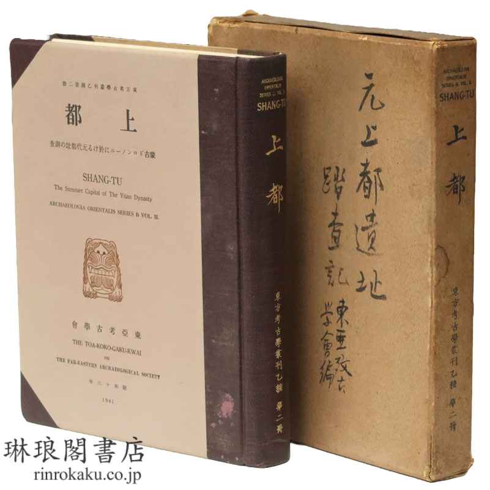

# 夏都

## "夏都"从哪儿来

<!--  -->

### 台词
《三体》第一季第三集，Jack 和 Jin 来到虚拟三体世界中，元世祖忽必烈建立的上都, 惊叹道："I think we're in *Shangdu*. Sometimes known as -- **Xanadu**. Where Kublai Khan decreed his stately pleasure-dome." Netflix 细心地做了三种中文译文，如下表：

| 语 | 类 | 文 |
| --- | --- | --- |
| 英文 | 字幕 & 语音 | I think we're in *Shangdu*. Sometimes known as -- **Xanadu**. Where Kublai Khan decreed his stately pleasure-dome. |
| 中文 | 语音 | 应该是*元上都*。有的时候也叫……**元夏都**，诗歌里忽必烈修建逍遥宫的地方。 |
| 中文 | 简体字幕 | 我们应该是来到了*商都*。有人称之为……**世外桃源**，是忽必烈下令建造的逍遥宫。 |
| 中文 | 繁体字幕 | 應該是*上都*。有時又稱為……**仙納度**，被忽必烈封為御用長樂穹宮。 |

“Xanadu”一词来自十八世纪英国诗人 Coleridge 的《忽必烈汗》，原意即为“上都”，但是在中文世界中却有着各种译法，其中“夏都”一词最引起我的好奇。便随意在维基百科上搜索“上都”词条，搭搭味道。

> 1267年，忽必烈定都燕京（1271年改称大都），改上都为陪都，亦为夏都，作为避暑行宫，于夏天在这里处理政务。

原来维基也用“夏都”一词。无聊之下细查，发现了“夏都”一词也引发了一场战争。

### 元上都
- -> 词条创建（2005年1月15日） 
  - > 上都，即今ｘｘ市，中国历史中元朝皇帝忽必烈的避暑行宫。
- -> 添加“陪都”（2005年3月10日） 
  - > 改为陪都，作避暑行宫
- -> 删“陪都”添“夏都”（2020年2月24日） 
  - > 改上都為夏都，作避暑行宮
- -> “夏都”不变，复加“陪都”（2022年1月19日）
  - > 改上都為陪都，亦作夏都，作避暑行宮

“夏都”一词在 wiki 上，居然是词条创建 15 年之后才被添加上去的。于是让我好奇，这个“夏都”一词最早源自哪里？编辑者好心地添加了注释来源。来自“杨富有. 从扈从诗分析元上都地位成因及其影响. 内蒙古大学学报(哲学社会科学版). 2012, (4).”但这来源是一百手资料了。

### 二十四史

为了找出“夏都”一词的来源，从正史开始，直接搜索电子版二十四史。只发现了《元史本紀世祖忽必烈》记“戊子，陞開平府為上都”，但搜索“夏都”出现两个词条均与上都无关。宋史、辽史、明史所记“夏都”也均与上都无关。所以……“夏都”的称谓从哪里来？

接着如何定位其他一手或接近一手资料呢？胡乱一通搜索后，发现了一本叶新民和齐木德道尔吉编著的《元上都研究资料选编》，该书

> 从辽、金、元、明、清以来形成的有关元上都的文献资料中精选了部分资料,编入“上都的自然环境“、“上都的兴建和布局“……“清朝初期的上都及察哈尔地区“等十二章,以求条理清楚,便于阅读和使用。

一通搜索还是没有发现“夏都”。似乎暗示了，“夏都”一词用以指代上都并非自古以来。

## “夏都”的出现

### 《元上都研究文集》

叶新民和齐木德道尔吉编著另有《元上都研究文集》，搜集了二十世纪以来有关元上都的研究文献。对此书的一番搜索，终于发现了“夏都”一词。可见，到了二十世纪，“夏都”一词已在特定场景下指代上都。文集中，有三篇论文使用了“夏都”

- 《关于元上都》
  - > 本世纪30年代，日本学者石田干之助开始利用文献资料研究上都历史。1938年发表了《关于元上都》（《考古杂志》第28卷第2、 8、12期）。后来，作者对原稿进行补充、修改，重新发表在《日本大学创立70周年纪念论文集》第1卷，人文科学编（1960年）。
- 《元朝诸帝季节性的游猎生活》
  - 劳延煊，原载《大陆杂志》（台湾）第二十六卷第三期，1963 年
- 《元上都的历史地位》
  - 肖瑞玲，原载《内蒙古师大学报》1998 年第 5 期

正对应着三个重要的汉字使用地区中国大陆、台湾和日本。大陆的文章时间较晚，先按下不表。

有到这两篇文章后，笔者试图寻找更早的记有“夏都”的文章，但是搜索结果却是空空如也。决定从这两篇文章开始，逐步追溯“夏都”一词的来源。

### 《关于元上都》

首先是日本学者石田干之助《关于元上都》一文，笔者试图寻找日语原文，仍未果。那么先看一下“夏都”在中文译本中的记录：

> 从至今残留的遗迹中仍然能够看到元上都往日的身影，不论是从元代浩如烟海的诗文，还是从顺帝的《哀两都赋》都能想象得到大元可汗**夏都**昔日繁荣一时的风采。

此文开头介绍了文章的由来。

> 昭和七年（1932）秋,我曾经在东洋文库第十九次讲座上,以《蒙古史领域诸发现》为题目做过四次讲演。其中第二次讲演是在十一月二十四日,题目为《元上都遗址探查研究》,讲演中首先陈述了东西方学者对元上都遗址考察研究的沿革,其次介绍了美国地理学者 Lawrence Impey 先生在 1925 年发表的实地踏查报告。他在报告中引用元代文献中有关上都的记载,追忆了上都当年的大体轮廓。讲演概要后经旗田魏、故岩佐精一郎二位整理被刊登在《史学杂志》第四十四编第一号(昭和八年一月,99一101页),对二位为拙稿编写摘要的辛勤之举,在此表示由衷的谢意。
> 
> 当时手头还有几份讲演概要,本愚做些充实再投稿,只因惰性一直拖到昭和十二年（1937）末。当时,以原田淑人博士为团长的东亚考古学会元上都遗址探查队刚好满载而归,我有幸见到了他们,于是冒出了也词能够为日后详细的报告提供一些参考的想法,就赶出一篇文章投给了《考古学杂志》第二十八卷第二·八·十二号(昭和十三年（1938）八月十二日),这便是旧稿《关于元上都》的由来。后来探查队发表了题目为《上都》的正式报告,也曾作为《东方考古学仰刊》的乙种第一册刊行过(昭和十六年（1941）十一月)。实地考察的成果也很详实,但是从文献中复原的有关旧时客其、城门、官衙、寺庙等的说明有些笼统,所以我在战争中偷闲,对旧稿进行了全面的补订,以期弥补考察报告的不足之处。能够补充的也只能是本稿了。定稿是在《上都》成书之前,所以除个别例子之外,尽量保留了稿子的原貌。笔者曾在《上都》一书附录中撰写过《关于元上都文籍解题》一文,以作参考,当然若能博得读者一阅,将是笔者莉大的欣慰。

石田不但撰写了《关于元上都》（《元の上都に就いて》）一文，介绍了美国地理学者 Lawrence Impey 在 1925 年发表的上都调查哦报告；还为日本东亚考古学会 1941 年出版的《上都》一书撰写了附录《关于元上都文籍解题》（《元の上都に關する主要文籍解題》），介绍了有关上都的文献资料。

### 石田干之助

继续讨论夏都前，我们先看一下石田干之助的重要履历：

> 1916年，石田大学毕业，随即入东京大学文科大学史学研究室当助手，次年，受东京大学派遣，到中国作学术调查。同时，受岩崎久弥财团的委托，负责接受岩崎久弥财团购买的英国《泰晤士报》驻京记者、中华民国总统政治顾问莫里循（George Ernest Morrison 1862－1920）的藏书。同年九月，莫里循文库到达东京，石田即出任文库主任，负责莫里循文库的整理和扩充工作。直到1924年，他一边是东大史学研究室的助手，一边兼任莫里循文库的主任，在学者生涯起步的八、九年间，埋头在以中国为中心的东洋学资料文献的整理中。1924年，岩崎财团决定以莫里循文库为基础成立“财团法人东洋文库”，石田继续负责文库的书籍经营，职位是主事。到1934年石田辞去东洋文库主事为止，前后为文库及所属东洋学研究所的扩充、发展，工作了17年） 。
>
> 可以说，莫里循文库因石田干之助的经营拓展获得新生，而对于石田而言，在工作刚起步的十七年间，整日浸润于如此庞大、得天独厚的东洋学资料宝库中，也使他的知识视野愈加广阔，学术功底愈加深厚，这是他一生学问的坚实基础。
> 
> 在介绍欧美东洋学研究方面，石田先后出版了《欧美支那学界现状一斑》（东亚研究讲座，东亚研究会，1925年），《欧人的支那研究》（1932年，1946年增订版）及《欧美的支那研究》（1942年），无论在日本还是在中国，这是最早全面介绍中国研究的欧洲学术情报资料，因此，各单行本也较早就被翻译引介到中国。晚至1997年，日本科学书院将后两种书影印合刊，题为《欧美、俄国、日本的中国研究》。[^dongyang]

对石田而言，其治学之道联通了东西方的学术研究。

<!--  -->

_^ 前排中莫理循、前排右石田干之助_

### 劳延煊

我们再来看一下，另一位在 1963 年就使用了“夏都”一词的劳延煊《元朝诸帝季节性的游猎生活》

> 世祖以后，元帝有一个固定的**夏都**，即上都开平府。

关于劳延煊的资料极少，一通网络搜索从各个角落的只言片语中，笔者拼凑出劳延煊的一些信息：

- 著名史学家劳干之子，主要研究元代南方文人的思想与生活。与Poppe、Turrell Wylie和Herbert Franke等学者合作，培养了一批优秀的蒙古学学者。[^lao_us]
- 1958年：劳延煊与余英时、张春树一同在哈佛选修了杨联陞的课程。[^lao_1958]
- 1962年：劳延煊获得哈佛大学博士学位，其学位论文是关于王恽《中堂事记》的译注。
- 1963年：发表了《元朝诸帝的季节性狩猎生活》和《金元诸帝游猎生活行帐》，刊登在台湾《大陆杂志》上。
- 1969年：发表了《<饮膳政要>中的非汉语名词诠释》，刊登在《历史语言研究所集刊》上。[^lao_papers]
- 1976年秋：到哈佛执教。[^lao_1976]
- (约)1997 - xxxx：任教于俄亥俄州立大学。[^lao_1997]

可见劳延煊的学术成就必定受惠于西方汉学。前文中提到的美国地理学者 Lawrence Impey 在 1925 年发表的 _Shangtu, the Summer Capital of Kublai Khan_ 一文劳延煊大约是读过的。

<!--  -->

原文中有这样一段：

> In this connection it may not be out of place to quote the picturesque description given by theworthy Friar Odoric of Pordenone of Kublai's journeying from winter to **summer capital**.
> > Now **this lord passeth the summer at a certain place which is called Sandu**, situated towards the north, and the coolest habitation in the world.

译文：

> 在此，引用波尔德诺内的奥德里克神父对忽必烈从冬都前往**夏都**旅程的生动描述，或许并不离题：
> > 现在，**这位君主在一个特定的地方度过夏天**，即上都，该地位于北方，是世上最凉爽的居所。

对比劳延煊《元朝诸帝季节性的游猎生活》的描述：

> 世祖以后，**元帝有一个固定的夏都**，即上都开平府……

似乎答案指向了 Lawrence Impey 的这篇文章。“夏都”是对英文“Summer Capital”的翻译！

### 《上都》调查报告

回到日本东亚考古学会的《上都》调查报告，笔者查询到日本 **国立国会図書館デジタルコレクション** 有《上都 : 蒙古ドロンノールに於ける元代都址の調査》一书的电子版 https://dl.ndl.go.jp/pid/1918142 但需要有日本证件登记才可以阅读，所以只能望洋兴叹。

但笔者设法找到了《上都》的书影

<!--  -->

^ _《上都》书影——来自[琳琅閣blog](https://www.rinrokaku.com/books_info/3076.html)_

此书出版时，自带英文名，__Shang-tu : the summer capital of the Yüan Dynasty__。《上都 : 蒙古ドロンノールに於ける元代都址の調査》日文名中译是：《上都 : 位于蒙古多伦诺尔的元代都城遗址调查》，但英文名中译却成了《上都：元夏都》

## 尾声

《剑桥中国辽西夏金元史》英文版出版时，其中引用了日本东亚考古学会《上都》调查报告，记为

> [177] Harada，Yoshito.Shang-tu：The summer capital of the Yuan dynasty.Tokyo：Tōa kokugakukai，1941.

多年后中译本出版时，该引用译为：

> 原田淑人：《元代夏都上都》。

## 参考书目

- 蒙元史研究导论
  - 蒙元史研究导论/陈得芝著.——南京：南京大学出版社，2012.5
- 中日古代城市研究
  - 中日古代城市研究/(日)中村圭尔、辛德勇编，北京：中国社会科学出版社，2004.3
- 元上都研究资料选编
  - 元上都研究资料选编/叶新民、齐木德道尔吉编著，北京：中央民族大学出版社，2003.8
- 元代大都上都研究
  - 元代大都上都研究/陈高华，史卫民著. 北京:中蛇人民大学出版社，2010
- 東亜考古学会上都调查报告
  - 原田淑人・駒井和愛編『元上都』東方考古学叢刊乙二、東亜考古学会、一九四一年
    - 上都 : 蒙古ドロンノールに於ける元代都址の調査
- _Shangtu, the Summer Capital of Kublai Khan_
  - _Shangtu, the Summer Capital of Kublai Khan_, Lawrence Impey, Geographical Review Vol. 15 No. 4 (Oct., 1925) pp. 584-604

[^dongyang]: 《石田干之助的东洋史研究》，钱婉约，関西大学東西学術研究所紀要 第51輯　2018年（平成30年）4月

[^lao_us]: [《當代美國蒙古學研究發展趨勢》蔡偉傑《蒙藏季刊》第二十一卷 第三期](https://themefile.culture.tw/file/2019-04-16/9bf62def-b2ca-4e16-8bb4-91cffac07f07/12%20%E7%95%B6%E4%BB%A3%E7%BE%8E%E5%9C%8B%E8%92%99%E5%8F%A4%E5%AD%B8%E7%A0%94%E7%A9%B6%E7%99%BC%E5%B1%95%E8%B6%A8%E5%8B%A2%EF%B9%8D%EF%B9%8D%E8%94%A1%E5%81%89%E5%82%91.pdf)

[^lao_1958]: “1958年2月哈佛开学，余英时和劳延煊（历史学家劳幹之子）、张春树选修了杨联陞的课” —— [杨联陞日记探微 | 周言 | 《南方周末》2016年6月22日](https://www.tsinghua.org.cn/info/1951/20621.htm)

[^lao_papers]: “劳延煊是1962年的哈佛大学博士，其学位论文为王恽《中堂事记》的译注。其后又发表《元朝诸帝的季节性狩猎生活》、《金元诸帝游猎生活行帐》（载台湾《大陆杂志》26∶3，27∶9，1963）、《<饮膳政要>中的非汉语名词诠释》（《历史语言研究所集刊》，39，1969）等文。现任教于俄亥俄州立大学，主要研究元代南方文人的思想与生活。” —— 陈得芝《蒙元史研究导论》第七章 国外蒙元史研究

[^lao_1976]: “特别是1976年秋季，延煊来哈佛执教，恰好碰到了一个“多事之秋”，无论在公领域或我们生活周边的私领域中都发生了一些重大的变故。” —— 余英时《师友记往：余英时怀旧集》

[^lao_1997]: 劳任教于俄亥俄州立大学的时间非常不确定，但是根据《蒙元史导论》中的记录：“本书系以白寿彝先生主编《中国通史》第八卷早期（序说）（汉文史料部分原由丁国范教授撰写）为基础修订增补而成。该书初版于1997年，2004年再版时《序说》部分没有进行修订。最近十多年，蒙元史的汉文史料又出了若干新点校、增补本或新发现的资料，蒙、藏文及其他多种文字史料也出有新的印本和译本，中外学者的研究更有显著进展，新成果层出不穷。白先生总主编的这部大型通史多达12卷22册，两版都是整部销售，对厚重更新代售的读者不便。第八卷的《序说》对中外多种文字史料和国内外（特别是国外）的蒙元史研究有比较详细的评介，据反映颇适合于学生（特别是研究生）作为入门书使用，所以抽出来作了较大幅度增删，改称《蒙元史研究导论》，单独刊行。因篇幅限制，诸家研究论著有不少只能“点到为止”，敬谈见谅。”那么首次出版的 1997 年劳大概率在俄亥俄州立大学任教，而2004年再版时，虽然未曾修订，但并不代表其依然还在俄亥俄州立大学任教，更有可能是作者没有再次查证。