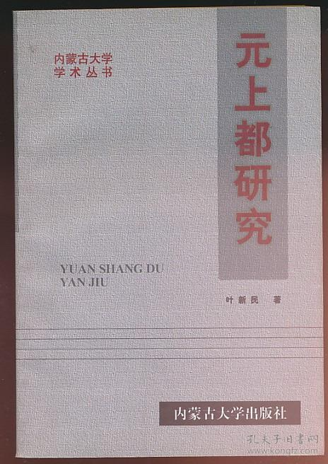

# “夏都”在大陆

接上文……

“夏都”一词来源于 Lawrence Impey 1925 年 发表的 _Shangtu, the Summer Capital of Kublai Khan_ 一文的日译和汉译。分别是石田干之助最早演讲于 1932 年，最后修改于 1960 年的《关于元上都》和劳延煊 1963 年发表于台湾《大陆杂志》的《元朝诸帝季节性的游猎生活》。而之前所能查到的最早中国大陆使用“夏都”一词，是肖瑞玲 1998 年发表于《内蒙古师大学报》的《元上都的历史地位》，与上两篇一同收录于《元上都研究文集》一书。

此时间离上两篇文章相隔了 35+ 年，大胆推测不会是大陆最早使用这一词的文章。

## 大都上都

发现最早集中研究元上都的书籍是陈高华著《元上都》一书，初版笔者未能找到，但是 2010 年出版了《元代大都上都研究》一书。书中提到

>陈高华著《元大都》1982年由北京出版社出版……陈高华、史卫民合著《元上都》1988年由吉林教育出版社出版。此书第一、二、三、五章及附录《元上都大事年表》由史卫民执笔，第四、六、七、八章由陈高华执笔。
>
> ……
>
> 此次重印,我们将《元大都》与《元上都》合在一起,分为上、下篇。这样便于读者了解元朝两都制度的全貌。……上、下篇附录所收两篇论文,陈高华所撰论述元代大都的饮食生活,可补《元大都》之不足。……

其中有三章使用了“夏都”一词

> 上京指上都开平,元朝皇帝的夏都,在今内蒙古正蓝於境内。[^drink]

> 上都是元代的夏都，每年皇帝有将近一半的时间在这里居住。[^manager]

> 正因为这样，一旦元朝朝溃,作为夏都的上都城也就无法维持下去了。[^downfall]

似乎问题在大方向上已经解决，但在查询两位的学术历程之后，有些疑问。

陈高华
> 陈高华 男，1938年3月3日生，浙江温岭人。1955年至1960年就读于北京大学历史系。毕业后，入中国科学院哲学社会科学学部（中国社会科学院前身）历史研究所工作。1985年评为研究员。历任中国社会科学院历史研究所副所长（1982-1988）、所长（1988-1991）、中国社会科学院学部委员、中央文史研究馆馆员。曾任中国史学会理事、中国元史研究会会长、中国海外交通史研究会会长等职。
>
> 主要研究方向为元史，兼治海外交通史、绘画史等。主要成果有《元史研究论稿》《陈高华文集》《元大都》《元代文化史》《中国海外交通史》《元代画家史料》《元典章》点校本等个人专著、合著、古籍整理等，发表论文近两百篇。其中，主持整理的《元典章》获第三届中国出版政府奖，《元代文化史》获第三届中华优秀出版物（图书）奖等。

史卫民
> 史卫民，曾任职于中国社会科学院历史研究所，现为中国社会科学院政治学研究所研究员，清华大学、南开大学兼职教授。主要从事政治学理论、政府理论、公共政策、元史等领域研究，近年出版和再版的主要著作有《政策民主》（1—4部）、《大一统》《元代社会生活史》，以及合著的《中国政治发展范式的选择》《元代政治制度史》《元代经济史》《元大都元上都研究》《中国大通史·元代卷》等。

逻辑上的问题是，从两位的学术简历来看，没有与国外蒙元史的深入接触，而且所引书目中，并没有使用“夏都”一词的文章，难道“夏都”一词是自发产生？似乎概率较低。要么之前的“夏都”来源于 Summer Capital 推理有漏洞，要么大陆的最早使用在更早的文章中。

继续，在知网上搜索，似乎陈、史在《元上都》出版之前，几乎没有单篇上都研究的文章。似乎大多文章是为了《元上都》而写的。

## 叶新民

依据《中日古代城市研究》中收入刘晓《元代都城史研究概述 —— 以上都、大都、中都为中心》
> 叶新华也是这方面用力较勤的学者，从80年代起，他先后发表有十余篇专题论文，内容涉及上都研究的各个方面，后结集为《元上都研究》一书出版。

再者，叶新民、齐木德道尔吉编著《元上都研究文集》的前言《元上都研究综述》由叶新民撰写，整理了上都研究的发展历史，引用了 _Shangtu, the Summer Capital of Kublai Khan_ 和石田干之助等多篇提到“夏都”的文章。可见，虽从简历中无法看出留洋或欧美教育背景，但相关文章必然十分了解。另，从齐木德道尔吉的简历，似乎也有助于此种推理。

> 齐木德道尔吉
> 
> 1984/7-1989/7，德国波恩大学中亚语言文化研究所蒙古语讲师，在职攻读博士学位，获德国波恩大学哲学博士学位；
>
> 1989/7-1990/3，德国波恩大学博士后；[^qimu]

到此，虽未看到叶新民《元上都研究》一书，但是在逻辑推理上，大陆“夏都”一词，出自叶新民是自洽的。所以赶紧从孔夫子上淘来了《元上都研究》一书。

## 《元上都研究》

《元上都研究》收入《从元人咏上都诗看滦阳风情》一九八二年十一月初稿，一九八三年十一月修改（原载《内蒙古大学学报》1984 年第 1 期）
> 元上都是元朝的夏都，是驰名中外的历史名城。[^poet]

## 参考书目

- 《蒙元史研究导论》
  - 蒙元史研究导论/陈得芝著.——南京：南京大学出版社，2012.5
- 《中日古代城市研究》
  - 中日古代城市研究/(日)中村圭尔、辛德勇编，北京：中国社会科学出版社，2004.3
- 《元上都研究资料选编》
  - 元上都研究资料选编/叶新民、齐木德道尔吉编著，北京：中央民族大学出版社，2003.8
- 《元上都研究文集》
  - 元上都研究文集/叶新民、齐木德道尔吉编著，北京：中央民族大学出版社，2003.8
- 《元代大都上都研究》
  - 元代大都上都研究/陈高华，史卫民著. 北京:中国人民大学出版社，2010
- 《元上都研究》
  - 元上都研究/叶新民著. 内蒙大学出版社，1998.7
- 《上都》调查报告
  - 原田淑人・駒井和愛編『元上都』東方考古学叢刊乙二、東亜考古学会、一九四一年
    - 上都 : 蒙古ドロンノールに於ける元代都址の調査

[^drink]: 《元代大都上都研究》上篇·元大都·附录二《元代大都的饮食生活》陈高华 
[^manager]: 《元代大都上都研究》下篇·元上都·第三章《上都的行政管理》陈高华
[^downfall]: 《元代大都上都研究》下篇·元上都·第八章《上都的没落》史卫民
[^qimu]: [齐木德道尔吉 - 内蒙古大学](https://mgxzx.imu.edu.cn/info/1050/1482.htm)
[^poet]: 《从元人咏上都诗看滦阳风情》一九八二年十一月初稿，一九八三年十一月修改（原载《内蒙古大学学报》1984 年第 1 期）